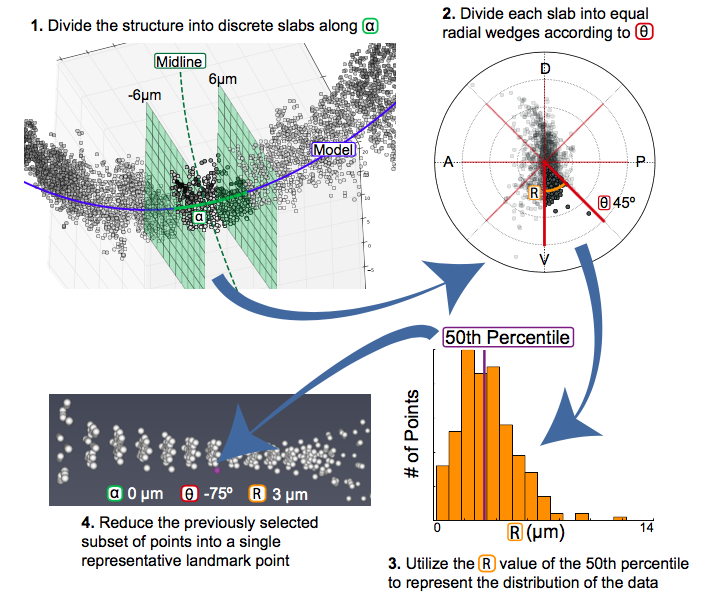

.. _landmark calc:

Landmark Calculation
=======================

Following the steps described in :ref:`data process`, your data should be saved as a set of :file:`.psi` files containing 6 values for each point: x,y,z,alpha,r,theta. Depending on the size and resolution of your original image, you will have thousands of points, which are unwieldy when you are trying to compare sample sets with several images. In order to reduce the size of the data and facilitate direct comparison, we calculate a set of landmarks that describe the data.

What is a landmark?
++++++++++++++++++++

Landmark points are frequently used in the study of morphology to describe and compare structures. Classically, an individual with expert knowledge of the structure would define a set of points that are present in all structures, but subject to variation. For example, in the human face, landmarks might be placed at the corners of the eyes and mouth as well as the tip of the nose. If we were to compare many different faces, we could use the difference in the position of the landmarks to describe how the faces varied.

Unbiased Landmarks
+++++++++++++++++++

The challenge with the classical approach to landmark analysis lies in the step of assigning landmarks. If an expert user is selecting regions of the structure to assign landmarks to, they are projecting their own expectations as to where they expect to see variation. We have developed a method of automatically calculating landmarks that describe the structure without bias and allow the user to discover new regions of interest.

How are landmarks calculated?
+++++++++++++++++++++++++++++++

The calculation of unbiased landmarks relies on :ref:`cylcoord` that were previously defined (:numref:`coordsystem`). First, the data is divided into equally sized sections along the alpha axis (:numref:`Fig landmarks`.1). The user specifies the number of divisions :envvar:`anum` and the data is divided accordingly. Next, each alpha subdivision is divided into radial wedges (:numref:`Fig landmarks`.2) according to the parameter :envvar:`tsize`, which specifies the size of each wedge. Finally, the distribution of points in the r axis is calculated according to the percentiles specified by the user in :envvar:`percbins` (:numref:`Fig landmarks`.3). Following these three steps, each subdivision can be represented by a single point that describes the distribution of the data in all three dimensions (:numref:`Fig landmarks`.4) For more information on these parameters, see :ref:`lm params`.

.. _Fig landmarks:

	In order to calculate landmarks, we will subdivide the data along the alpha and theta axes before calculating the r value that describes the distribution of the data.

.. _sel anum:

Selecting :envvar:`anum`
+++++++++++++++++++++++++